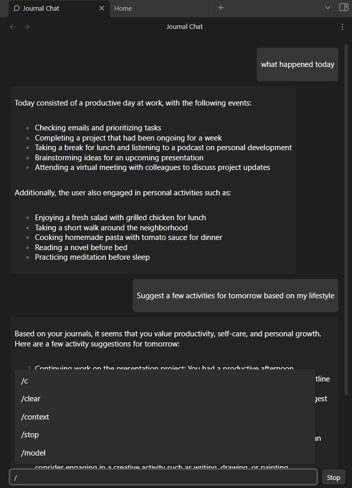

# Journal Chat Plugin

### Overview

The Journal Chat Plugin for Obsidian enhances your journaling experience by integrating local AI capabilities. It allows you to explore old memories and conduct enhanced periodic reviews using the Ollama AI model.

Also functions as a vanilla Ollama chatbot frontend within obsidian if you don't provide it any context.

### Usage Guide

**Set up your model.**  
It is recommended that you use a smaller model (depending on hardware) as this uses the entire context instead of embeddings.

**Set up your journals/daily notes folder.**  
Currently only supports YYYY-MM-DD dates.

**Setting Context (adding your journals to the AI's brain):**  
Add a date range to the context by typing \`/context {daterange}\`. Accepts most natural language input.

- Example: \`/context 1 jan 2023 to 31 feb 2023\`
- Example: \`/context 2 months ago to today\`

You can change the context mid-chat by typing \`/context\` again.

**Ask your question.**  
Example: \`What was my life like during this period?\`

**Other commands:**

- \`/clear /c\` - Clear chat and context
- \`/stop\` - Stop generating response

### License
This project is licensed under the MIT License. See the LICENSE file for details.

